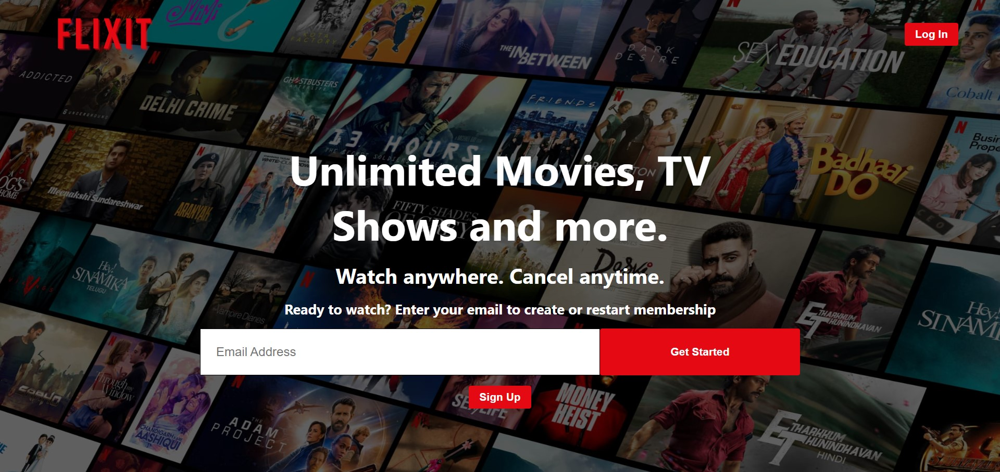
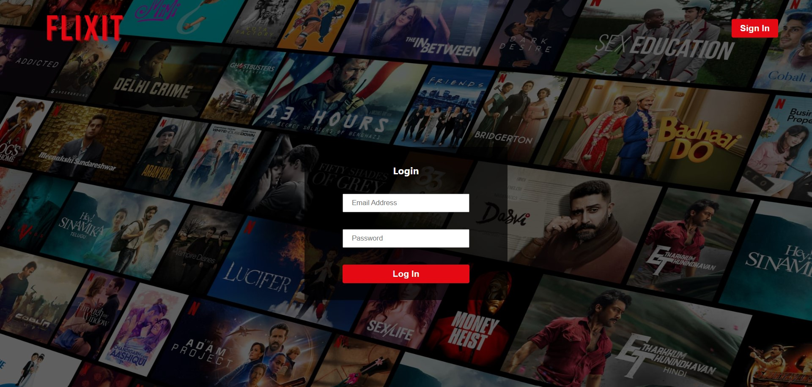
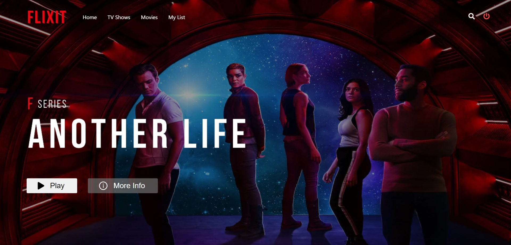
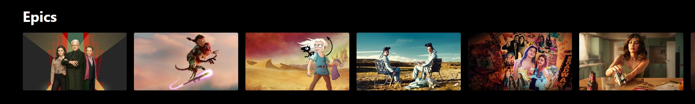

# FLIXIT - "Watch More. Watch Better."

Flixit is a video steaming web app like Netflix to watch movies and tv shows online. Flixit is not just a streaming service; it's your passport to endless entertainment. Step into a world of captivating stories, thrilling adventures, and unparalleled variety with Flixit.


**Unrivaled Content Library :**<br />
Explore a vast library of movies, TV shows, documentaries, and exclusive original series, meticulously curated to cater to every taste and preference. Whether you're a fan of heart-pounding action, heartwarming romances, or mind-bending sci-fi, Flixit has it all.

**Seamless User Experience :**<br />
With a user-friendly interface designed for effortless navigation, Flixit ensures you spend less time searching and more time enjoying your favorite content. Personalized recommendations, user profiles, and customizable playlists make your streaming experience truly unique.
<br />
<br />
Join the Flixit community today and unlock a world of entertainment that knows no bounds. Whether you're a cinephile, TV buff, or just looking for your next binge-watching obsession. Flixit has it all. Get ready to dive into a universe of entertainment, only a click away!

## Project Info :

- ### Flixit-UI :

  | Tech      | Selection / Commands               |
  | --------- | ---------------------------------- |
  | Flixit-UI | Vite + React                       |
  | UI Setup  | `npm create vite@latest flixit-ui` |
  | Framework | React                              |
  | Varient   | JavaScript + SWC                   |

  **Dependencies used :**

  | Dependency        | Version | Command                   |
  | ----------------- | ------- | ------------------------- |
  | axios             | ^1.5.0  | `npm i axios`             |
  | firebase          | ^10.3.1 | `npm i firebase`          |
  | styled-components | ^6.0.7  | `npm i styled-components` |
  | react-icons       | ^4.10.1 | `npm i react-icons`       |
  | react-redux       | ^8.1.2  | `npm i react-redux`       |
  | @reduxjs/toolkit  | ^1.9.5  | `npm i @reduxjs/toolkit`  |
  | react-router-dom  | ^6.15.0 | `npm i react-router-dom`  |

  **Folder Structure :**

  - `FLIXIT` - Root Directory
    - `flixit-ui` - Root UI Directory
      - `node_modules` - Contains all dependency files used in flixit-ui
      - `public` - Contains all the public files for flixit-ui
        - `flixit.svg`
      - `src` - Contains all the source files for flixit-ui
        - `assets` - Contains assests for flixit-ui
          - `card.jpg`
          - `home.jpg`
          - `homeTitle.webp`
          - `logo.png`
          - `login.jpg`
          - `video.mp4`
        - `components` - Contains all the components used in flixit-ui
          - `Navbar.jsx`
          - `Header.jsx`
          - `BackgroundImage.jsx`
          - `Card.jsx`
          - `CardSlider.jsx`
          - `Slider.jsx`
          - `NotAvailable.jsx`
          - `SelectGenre.jsx`
        - `pages` - Contains all the pages for flixit-ui
          - `Flixit.jsx`
          - `Login.jsx`
          - `Signup.jsx`
          - `Movies.jsx`
          - `TVShows.jsx`
          - `Player.jsx`
          - `UserLiked.jsx`
        - `store`
          - `index.js`
        - `utils`
          - `constants.js`
          - `firebase-config.js`
        - `App.jsx`
        - `index.css`
        - `main.jsx`
      - `.eslintrc.cjs`
      - `.gitignore`
      - `.index.html`
      - `package-lock.json`
      - `package.json`
      - `README.md`
      - `vite.config.js`

- ### Flixit-API :

  | Tech       | Selection / Commands     |
  | ---------- | ------------------------ |
  | Flixit-API | Node + Express + MongoDB |
  | Setup      | `npm init -y`            |

  **Dependencies used :**
  |Dependency| Version| Command|
  |----------|--------|--------|
  |cors | ^2.8.5 | `npm i cors`|
  |dotenv | ^16.3.1 | `npm i dotenv`|
  |express | ^4.18.2 | `npm i express`|
  |mongoose | ^7.5.1 | `npm i mongoose`|
  |nodemon | ^3.0.1 | `npm i nodemon`|

  **Folder Structure :**

  - `FLIXIT` - Root Directory
    - `flixit-api` - Root API Directory
      - `node_modules` - Contains all dependency files used in flixit-api
      - `controllers`
        - `UserController.js`
      - `models`
        - `UserModel.js`
      - `routes`
        - `UserRoutes.js`
      - `server.js`
      - `.env`
      - `.gitignore`
      - `package-lock.json`
      - `package.json`

## Project Setup :

- Clone entire project repo.
- Open the cloned project with VS code.
- Open VS code terminal : `` ctrl + ` ``.
- **Setting up flixit-ui :**
  - Go to flixit-ui directory : `cd flixit-ui`.
  - Install all the dependencies for flixit-ui
    ```
    npm install
    ```
  - Run flixit-ui
    ```
    npm run dev
    ```
- **Setting up flixit-api :**
  - Go to flixit-ui directory : `cd flixit-api`.
  - Install all the dependencies for flixit-api
    ```
    npm install
    ```
  - Run flixit-api server
    ```
    npm run dev
    ```

# Project Snapshots :

## Signup :



## Login :



## Home :






**All Rights Reserved - Manjunath Ramoji**
